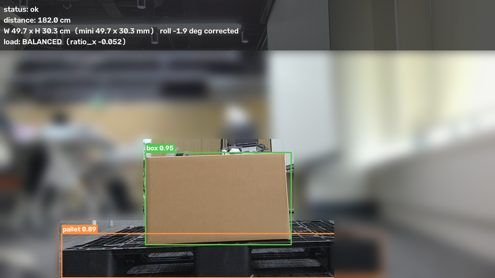
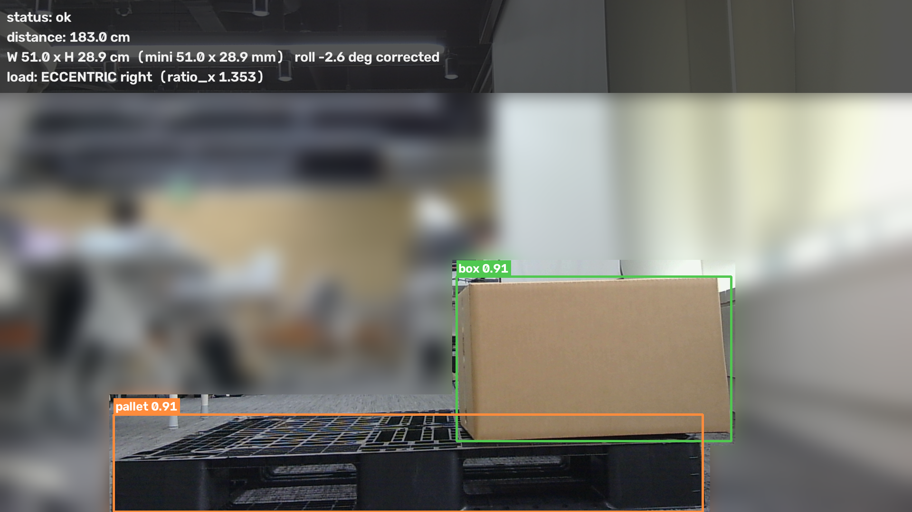
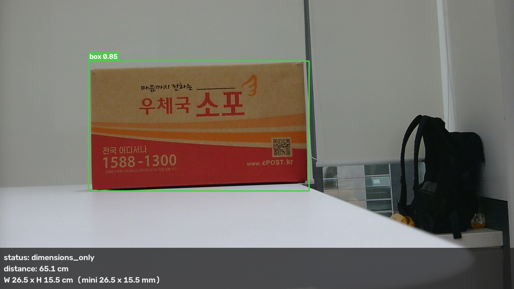

# F.A.S.T. — AI 무인 지게차 기반 디지털 트윈 물류 자동화 시스템

카메라와 거리계로 화물을 재고, 그 값으로 적재 위치를 정하고, 무인 지게차가 파렛트에 포크를 꽂아 옮기는 것까지를 한 줄로 이은 시스템이다. 측정·주행·제어·관제·시뮬레이션이 REST와 MQTT 두 가지 방식으로만 대화한다.

SSAFY 15기 공통 프로젝트 (2026-07 ~ 2026-08) · 6인 팀 · 프로젝트 코드 `S15P11A304`

> 실물은 1/10 스케일 미니어처 지게차와 창고다. 화물 측정은 실제 카메라·거리계로 하고, 다중 차량 운영은 Isaac Sim 디지털 트윈으로 시연한다.

---

## 무엇을 만들었나

| 덩어리 | 하는 일 |
|---|---|
| **측정 스테이션** | 지게차에 싣기 전 화물의 치수·전복 위험·편하중을 잰다. 카메라 + 거리계 + 검출 모델 |
| **무인 지게차** | Nav2로 목표까지 자율주행하고, 온보드 비전으로 파렛트 구멍을 찾아 포크를 꽂는다 |
| **클라우드 백엔드** | 작업을 만들고 차량에 배정하며, 측정 결과로 적재 위치를 정한다. 상태를 관제 화면에 중계한다 |
| **디지털 트윈** | 가상 창고에서 다중 지게차를 시뮬레이션하고, 실물 위치를 받아 반영한다 |

**아키텍처 다이어그램 →** [docs/아키텍처-다이어그램.md](docs/아키텍처-다이어그램.md)

---

## 측정한 결과

숫자는 전부 실물에서 잰 값이다. 시뮬레이션이나 공개 데이터셋 성능이 아니다.

| 항목 | 결과 | 목표 |
|---|---|---|
| 화물 치수 오차 | **평균 0.66 mm** / 최대 2.10 mm | ≤ 4 mm |
| 검출 성능 (실물 리그 평가셋) | **mAP@0.5 = 0.9898** (박스 0.9795 / 파렛트 1.0000) | — |
| 온보드 추론 (Jetson Orin Nano) | **GPU 10.18 ms** · 전처리 포함 종단 44.96 ms (22.2 fps) | ≤ 100 ms |
| 파렛트 구멍 검출 재현율 | **99.5 %** (220/221) | — |
| 파렛트 검출 재현율 / 오탐 | **100 %** (105/105) / 네거티브 120장에 **0 건** | — |
| 무인 측정 실물 검증 | 화물 높이 **92.3 mm** vs 실측 91.5 mm (**오차 0.8 mm**) | — |
| 포크 정렬 | **45° 로 돌아간 파렛트에 관통 성공** (재접근 9회, 표본 1회) | — |

---

## 실제로 어떻게 보이나

측정 스테이션이 화물을 보고 판단하는 화면이다. 박스와 파렛트를 각각 잡고, 거리계로 잰 거리로 화면 픽셀을 실치수로 바꾸고, 박스가 파렛트 위 어디에 얹혔는지로 편하중을 판정한다.

| 정상 적재 | 편하중 |
|---|---|
|  |  |
| `load: BALANCED (ratio_x -0.052)` | `load: ECCENTRIC right (ratio_x 1.353)` |

같은 박스를 파렛트 오른쪽으로 밀어놓은 것만 다르다. 박스 중심과 파렛트 중심의 어긋남을 파렛트 폭으로 나눈 값(`ratio_x`)이 -0.052에서 1.353으로 뛰면서 `ECCENTRIC right`로 넘어간다.



파렛트 없이 박스만 있으면 `dimensions_only`로 떨어진다. 치수는 내지만 전복·편하중 판정은 하지 않는다 — 기준이 될 지지면이 없기 때문이다.

---

## 기술 스택

| 영역 | 사용 기술 |
|---|---|
| **AI · 비전** | RTMDet-m / RTMDet-s · MMDetection · MMDeploy · ONNX Runtime · TensorRT FP16 · OpenCV |
| **온보드** | Jetson Orin Nano (JetPack 6 / CUDA 12.6 / TensorRT 10.3) · ROS 2 Humble · Nav2 · AMCL · SLAM |
| **임베디드** | ESP32-S3 · ESP-IDF / FreeRTOS · PCA9685 PWM · MPU6500 IMU · MG996R 서보 |
| **백엔드** | Java 21 · Spring Boot 3.3.4 · MyBatis · MySQL 8 · Spring Integration MQTT (Eclipse Paho) |
| **프론트** | Next.js 16 · React 19 · TypeScript · Tailwind CSS 4 · shadcn/ui · STOMP over SockJS |
| **인프라** | AWS EC2 · Docker Compose · Eclipse Mosquitto 2 (MQTT over TLS) · MediaMTX · GitLab CI/CD · systemd |
| **시뮬레이션** | NVIDIA Isaac Sim 5.1 · Omniverse · USD |

---

## 팀과 기여 범위

6인 팀 프로젝트다. 커밋 이력 기준으로 각자 손댄 영역이 나뉜다.

| 담당 | 이름 | 주 영역 |
|---|---|---|
| **AI · 비전 · 제어** | 방지섭 (본인) | `ai/` · 스테이션 측정 · 온보드 추론 · 포크 정렬 제어 · 조향 펌웨어 |
| 백엔드 · 프론트 | 김재원 | `src/` · `frontend/` |
| 백엔드 · 프론트 | 전지웅 | `src/` · `frontend/` · AI 학습 데이터 수집 |
| ROS 2 · 임베디드 · 하드웨어 | 안제원 | `ros2_ws/` · `firmware/` · `3d_model/` |
| ROS 2 · 임베디드 | 전희창 | `ros2_ws/` · `firmware/` |
| 디지털 트윈 | 이준서 | `isaac_sim/` |

### 본인이 한 것

- **화물 측정 파이프라인** — 카메라·거리계·검출 모델을 묶어 치수·전복 위험·편하중을 내고, 세션을 열어 REST로 백엔드에 올리기까지. 무인 자동 측정(MQTT 트리거 → 정지 대기 → 촬영 → 전송 → 세션 종료)을 실물로 완주시켰다.
- **검출 모델 학습·승격** — 공개 데이터셋에서 시작해 실물 리그·가림 상황까지 도메인을 넓히며 재학습했다. 승격 조건을 착수 전에 못 박고(목표 도메인 지표 / 기존 성능 회귀 없음 / 망각 없음) 셋 다 통과할 때만 교체했다.
- **온보드 추론 이식** — 학습 산출물을 ONNX → TensorRT FP16으로 변환해 Jetson에 올리고, HTTP 추론 서버로 만들어 systemd 자동 기동까지 붙였다.
- **포크 정렬 제어** — 파렛트 구멍 두 개의 화면 좌표에서 좌우 오차와 요각을 기하로 계산해 `/cmd_vel`을 내는 상태기계(SEARCH → APPROACH → ALIGN → VERIFY → INSERT, 실패 시 RETREAT 후 재접근).
- **조향 펌웨어 수정** — 아래 트러블슈팅 참조.

---

## 기술적으로 어려웠던 것

포폴에 남길 값어치가 있는 것은 잘 된 것보다 **틀렸던 것을 어떻게 찾았나**라고 생각해서 세 개만 적는다.

### 1. 제어가 안 먹어서 게인을 이틀 의심했는데, 원인은 서보 펄스 범위였다

포크 정렬이 45° 틀어진 파렛트 앞에서 발산하고, ALIGN 상태에서 요각이 교정되지 않았다. 매끈한 사인파 형태의 진동이라 "폐루프 한계진동"으로 읽고 게인과 감쇠를 계속 만졌다.

실제 원인은 펌웨어의 `SERVO_MIN/MAX_PULSE_US`가 `1000~2000 µs`로 잡혀 있던 것이었다. MG996R은 `500~2500 µs`가 180°라, 코드가 28°라고 믿는 명령이 바퀴에서는 **8°**로만 나왔다 — 명령 대비 실제 회전이 `tan(8°)/tan(28°)` = **21~26 %**. 범위를 고치자 뒷바퀴 실각도가 36°가 되고 45° 파렛트 관통이 됐다.

**얻은 것**: 파라미터를 바꿔도 거동이 안 변하면 제어 루프 **밖**을 본다. 명령 단위와 물리 단위 사이 변환은 한 번은 자로 잰다 — 각도기로 바퀴를 재는 데 5분이면 됐을 일이었다. 이론적으로 옳은 추론(한계진동)이 오히려 조사를 루프 안에 가뒀다.

### 2. 모델이 못 잡는 것은 코드 문제가 아니라 데이터 분포 문제였다 (3회)

같은 종류의 실패를 세 번 겪었다. 책상 클로즈업 박스 미검출, 검은 플라스틱 파렛트가 **임계 0.02에서도 0건**, 화물이 파렛트를 덮으면 score 0.101. 매번 전처리와 임계를 먼저 의심했지만, 셋 다 학습셋에 그 분포가 없어서였다. 마지막 건은 학습셋의 가림률 30% 이상 샘플이 **0장**이었다.

**얻은 것**: 증상을 보면 코드보다 **학습셋 분포를 먼저 세어본다.** 그리고 오탐은 임계 상향이 아니라 기하 조건으로 거른다 — 임계를 0.5에서 0.7로 올리면 재현율이 95.5%에서 91.1%로 같이 깎였다.

### 3. 가장 비싼 버그는 에러를 안 내고 그럴듯한 답을 내는 것이었다

젯슨 추론 서버를 멀티스레드로 띄우자 pycuda의 CUDA 컨텍스트가 생성 스레드에 묶여 매 요청이 실패했는데, **예외가 아니라 검출 0개**로 나가고 서버는 HTTP 200을 응답했다. 클라이언트는 "물체가 없나 보다" 하고 넘어간다. 같은 날 비슷한 것을 다섯 건 더 잡았다 — 경로별 임계 불일치로 `ok`가 조용히 `dimensions_only`가 되고, 정지 판정 임계가 카메라 노이즈 바닥 아래라 "멎었다"가 영원히 성립하지 않고, 녹화 fps에 요청 상한값을 써서 영상이 1.45배 빨리 감겼다.

**얻은 것**: 실패를 성공처럼 보이게 하는 반환값(빈 목록·기본값·상한값)을 그대로 흘리지 않는다. 기동 자가진단을 넣고, 폴백·가정값은 화면과 로그에 항상 표시한다. 임계는 추측하지 말고 노이즈 바닥을 재고 정한다.

---

## 저장소 구조

```
ai/          검출 모델 학습·평가, 측정 스테이션, 온보드 추론, 포크 정렬 제어
src/         Spring Boot 백엔드
frontend/    Next.js 관제 대시보드
ros2_ws/     ROS 2 패키지 (MQTT 브리지, 텔레옵)
firmware/    ESP32-S3 모터 컨트롤러 (ESP-IDF)
isaac_sim/   디지털 트윈 · Nav2 시뮬레이션
infra/       MQTT 브로커 구성
3d_model/    출력용 하드웨어 파츠 (실물 사진 포함)
hardware/    미니어처 박스·파렛트 OpenSCAD 모델
scripts/     배포·점검 스크립트
docs/        설계·검증·운영 문서
발표자료/     발표용 스틸과 원고
```

## 문서

| 내용 | 경로 |
|---|---|
| 아키텍처 다이어그램 | [docs/아키텍처-다이어그램.md](docs/아키텍처-다이어그램.md) |
| 다이어그램 작성 명세 (블록·연결·검증 상태) | [docs/아키텍처-다이어그램-명세.md](docs/아키텍처-다이어그램-명세.md) |
| 요구사항 명세서 | [docs/요구사항명세서.md](docs/요구사항명세서.md) |
| 포크 정렬 설계 근거 | [docs/ai/onboard-fork-align-design.md](docs/ai/onboard-fork-align-design.md) |
| 온보드 TensorRT 절차 | [docs/ai/onboard-tensorrt-runbook.md](docs/ai/onboard-tensorrt-runbook.md) |
| 스테이션 측정 핸드오프 규격 | [docs/ai/station-measurement-handoff.md](docs/ai/station-measurement-handoff.md) |
| 화물 측정 연동 계약 | [docs/backend-message/cargo-measurement-workflow-contract.md](docs/backend-message/cargo-measurement-workflow-contract.md) |
| 관제 화면 와이어프레임 | [docs/와이어프레임-관제화면.md](docs/와이어프레임-관제화면.md) |
| 백엔드 README | [docs/backend-readme.md](docs/backend-readme.md) |
| 스프린트 회고 (KPT) | [docs/KPT/](docs/KPT/) |
