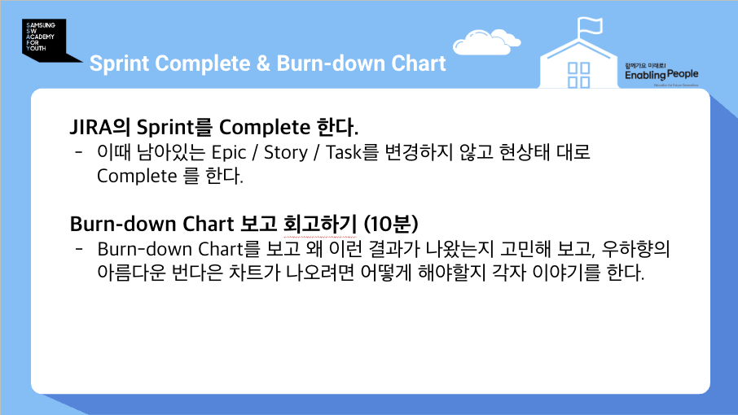
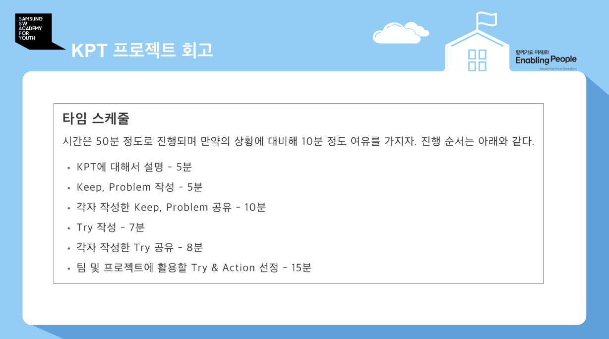
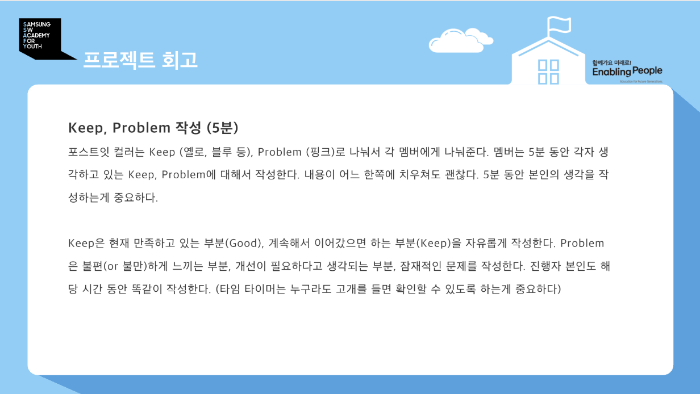
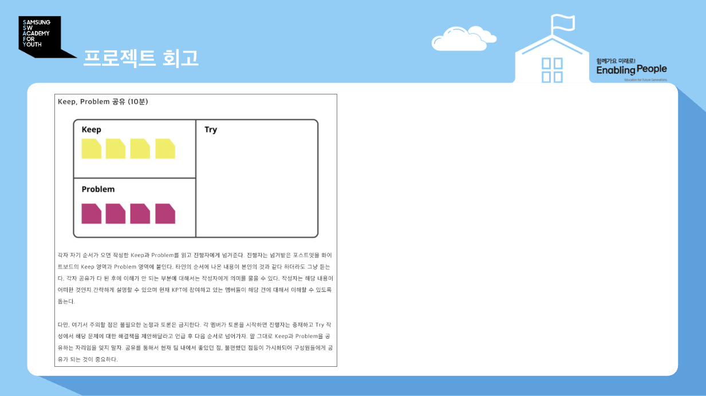
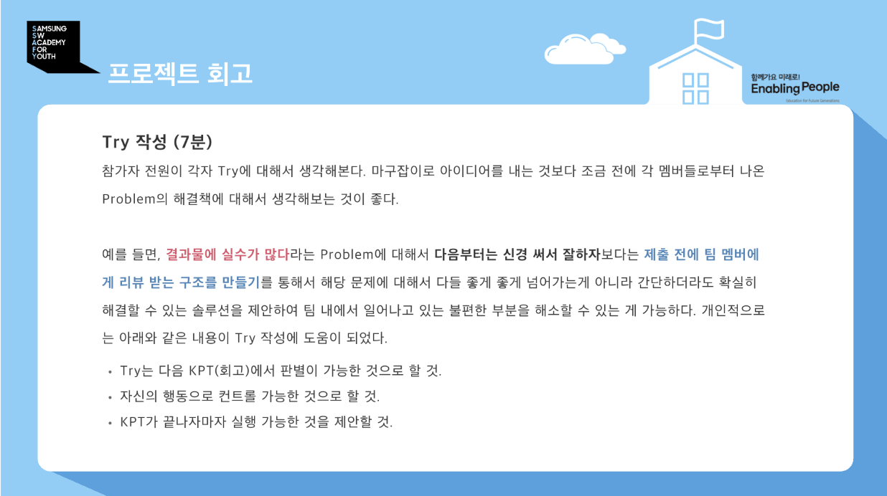

# 스프린트 회고 가이드 (KPT)

> 출처: SSAFY Agile 회고방법 교육 자료 (원본 슬라이드: [images/](images/)). 스프린트 종료 시 Sprint Complete → 번다운 회고 → KPT 순으로 진행한다.

## 사전 절차: Sprint Complete & 번다운 회고

1. Jira의 Sprint를 Complete 한다. 이때 남아있는 Epic/Story/Task의 **상태는 변경하지 않고 현상태 그대로** 둔다 — 회고 직전에 이슈를 완료로 밀어넣으면 번다운이 실제보다 좋아 보여 회고할 거리가 사라진다.

   > ⚠️ **단, Complete 다이얼로그에서 미완료 이슈는 반드시 "다음 스프린트로 이동"을 고른다.**
   > "상태를 그대로 둔다"는 것은 *진행 중/해야 할 일 상태를 조작하지 말라*는 뜻이지,
   > 이슈를 닫힌 스프린트에 남겨두라는 뜻이 아니다. 닫힌 스프린트에 갇힌 이슈는
   > **활성 보드에도 번다운에도 잡히지 않아 사실상 잊혀진다.**
   >
   > 실제 사례 (2026-07-27): Sprint 1을 Complete하면서 미완료 6건이 Sprint 1에만 남아
   > Sprint 2 보드에 나타나지 않았다. 그중 150(3D 출력)은 "진행 중"인 채로 사흘간
   > 보드에서 사라져 있었다. 뒤늦게 6건을 일괄 이월했다.

2. **번다운 차트 회고 (10분)**: Burn-down Chart를 보고 왜 이런 결과가 나왔는지 고민해 보고, 우하향의 아름다운 번다운 차트가 나오려면 어떻게 해야 할지 각자 이야기한다.
3. **이월 확인**: Complete 후 활성 스프린트 보드에서 이월된 이슈가 실제로 보이는지 눈으로 확인한다. JQL로도 볼 수 있다 — `sprint = <직전스프린트ID> AND statusCategory != Done AND sprint != <새스프린트ID>` 결과가 **0건**이어야 정상이다.

## KPT 타임 스케줄 (총 50분 + 예비 10분)

| 순서 | 활동 | 시간 |
|---|---|---|
| 1 | KPT에 대해서 설명 | 5분 |
| 2 | Keep, Problem 작성 | 5분 |
| 3 | 각자 작성한 Keep, Problem 공유 | 10분 |
| 4 | Try 작성 | 7분 |
| 5 | 각자 작성한 Try 공유 | 8분 |
| 6 | 팀 및 프로젝트에 활용할 Try & Action 선정 | 15분 |

> 문서로 남길 때의 규칙(**K·P·T 각각 한 줄**, 남의 항목 대신 쓰지 않기, 번다운은
> 실데이터로)은 [§5 문서화 규칙](#5-문서화-규칙) 참조.

## 1. Keep, Problem 작성 (5분)

- 포스트잇 컬러를 **Keep(옐로, 블루 등)**, **Problem(핑크)**으로 나눠서 각 멤버에게 나눠준다.
- 멤버는 5분 동안 각자 생각하고 있는 Keep, Problem을 작성한다. 내용이 어느 한쪽에 치우쳐도 괜찮다. 5분 동안 본인의 생각을 작성하는 게 중요하다.
- **Keep**: 현재 만족하고 있는 부분(Good), 계속해서 이어갔으면 하는 부분을 자유롭게 작성한다.
- **Problem**: 불편(or 불만)하게 느끼는 부분, 개선이 필요하다고 생각되는 부분, 잠재적인 문제를 작성한다.
- **진행자 본인도 해당 시간 동안 똑같이 작성한다.**
- 타임 타이머는 누구라도 고개를 들면 확인할 수 있는 위치에 둔다.

## 2. Keep, Problem 공유 (10분)

화이트보드를 Keep / Problem / Try 세 영역으로 나눈다.

- 각자 자기 순서가 오면 작성한 Keep과 Problem을 읽고 진행자에게 넘겨준다. 진행자는 넘겨받은 포스트잇을 화이트보드의 Keep 영역과 Problem 영역에 붙인다.
- 타인의 순서에 나온 내용이 본인 것과 같더라도 그냥 듣는다.
- 각자 공유가 다 된 후에 이해가 안 되는 부분은 작성자에게 의미를 물을 수 있다. 작성자는 간략하게 설명해 멤버들이 이해할 수 있도록 돕는다.
- **불필요한 논쟁과 토론은 금지.** 멤버가 토론을 시작하면 진행자는 중재하고, "Try 작성에서 해당 문제에 대한 해결책을 제안해달라"고 언급 후 다음 순서로 넘어간다.
- 이 자리는 Keep과 Problem을 **공유하는 자리**다. 공유를 통해 팀 내에서 좋았던 점, 불편했던 점들이 가시화되어 구성원들에게 공유되는 것이 중요하다.

## 3. Try 작성 (7분)

- 참가자 전원이 각자 Try를 생각해 본다. 마구잡이로 아이디어를 내기보다 조금 전 멤버들로부터 나온 **Problem의 해결책**에 대해 생각해 보는 것이 좋다.
- 예: "결과물에 실수가 많다"는 Problem에 대해 "다음부터는 신경 써서 잘하자"(X)보다는 **"제출 전에 팀 멤버에게 리뷰 받는 구조를 만들기"(O)** — 좋게 좋게 넘어가지 않고, 간단하더라도 확실히 해결할 수 있는 솔루션을 제안한다.

좋은 Try의 조건:

1. 다음 KPT(회고)에서 **판별이 가능한 것**
2. **자신의 행동으로 컨트롤 가능한 것**
3. KPT가 끝나자마자 **실행 가능한 것**

## 4. Try 공유 (8분) 및 Try & Action 선정 (15분)

각자 작성한 Try를 공유한 뒤, 팀 및 프로젝트에 실제로 적용할 Try & Action을 선정한다.

## 5. 문서화 규칙

회고 결과는 `docs/KPT/Sprint{N}-KPT.md`에 팀원별 섹션으로 남긴다. 형식은
[Sprint0-KPT.md](Sprint0-KPT.md) 참조.

### Keep / Problem / Try는 **각각 한 줄**로 쓴다

한 사람이 K·P·T 각 항목에 **불릿 하나씩**, 총 세 줄이다. 여러 개가 떠오르면
**가장 중요한 하나로 합치거나 고른다.**

- **읽히라고 쓰는 것이다.** 여섯 명 × 세 항목이면, 항목마다 세 줄씩만 써도 54줄이
  된다. 다음 스프린트 시작할 때 아무도 안 읽는다.
- **고르는 과정이 회고다.** 세 개를 나열하면 우선순위를 안 정한 것이다. 하나로 줄이면
  "이번 스프린트에서 가장 바꿔야 할 게 뭔가"를 스스로 답하게 된다.
- 한 줄이 **짧아야 한다는 뜻은 아니다.** 근거·수치를 담아 길어도 되지만 **불릿은 하나**다.

> 좋은 예 (Sprint 2) — 원인·결과·수치가 한 줄에 들어 있다:
>
> - **Problem**: 캘리브레이션 도구를 합성 데이터로만 검증하고 사람이 손으로 들고 쓰는
>   조건을 안 봐서 20장 중 14장이 블러로 버려졌는데, 원인을 "자세 다양성 부족"으로
>   단정하는 바람에 재촬영을 두 번 시켰다

### 남의 항목을 대신 쓰지 않는다

회고는 각자 쓰는 것이다. 문서를 미리 만들어 둘 때는 **본인 섹션만 채우고 나머지는
빈 칸으로 둔다.** 대신 채워 넣으면 그 사람이 실제로 무엇을 느꼈는지가 사라지고,
다음 회고에서 Try 이행 여부를 물을 근거도 없어진다.

### 번다운 회고는 Jira 실데이터로 적는다

체감이 아니라 숫자다. 최소한 **전체 이슈·SP, 완료율, 담당자별 완료/배정 SP,
미완료 이슈 목록**을 적고, 직전 스프린트와 비교한다. 미완료 목록을 적어두면
§사전절차의 이월 누락도 같이 걸린다.
