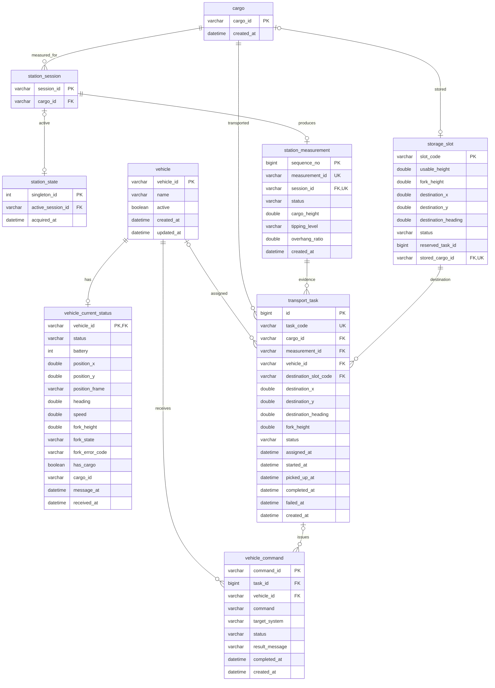

# MVP 데이터베이스 ERD

정본 SQL은 `src/main/resources/db/schema.sql`이다. 모든 길이·좌표는 `m`, 속도는 `m/s`, 방향은 `degree`를 사용한다.

## 관계 해설

- 화물 하나는 여러 번 측정 세션을 가질 수 있지만 세션 하나의 최종 측정 결과는 최대 한 건이다.
- `station_state`는 `singleton_id=1`인 단일 행으로 현재 활성 세션만 가리킨다.
- 차량 현재 상태는 차량별 한 행만 유지한다.
- 적재 위치는 최대 한 화물을 보관하고, 운반 작업 생성 시 한 작업이 예약한다.
- 운반 작업은 실제 사용한 측정 결과와 선택한 목적지 정보를 보존한다.
- 차량 명령은 운반 작업과 연결될 수도 있고 독립 명령일 수도 있다.

`storage_slot.reserved_task_id`는 생성 순환을 피하기 위해 물리 FK를 두지 않는다. 애플리케이션이 `EMPTY → RESERVED` 조건부 갱신으로 소유권을 보장한다.
