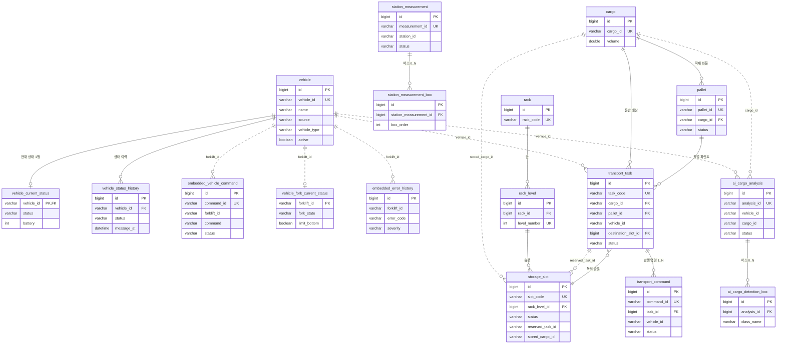
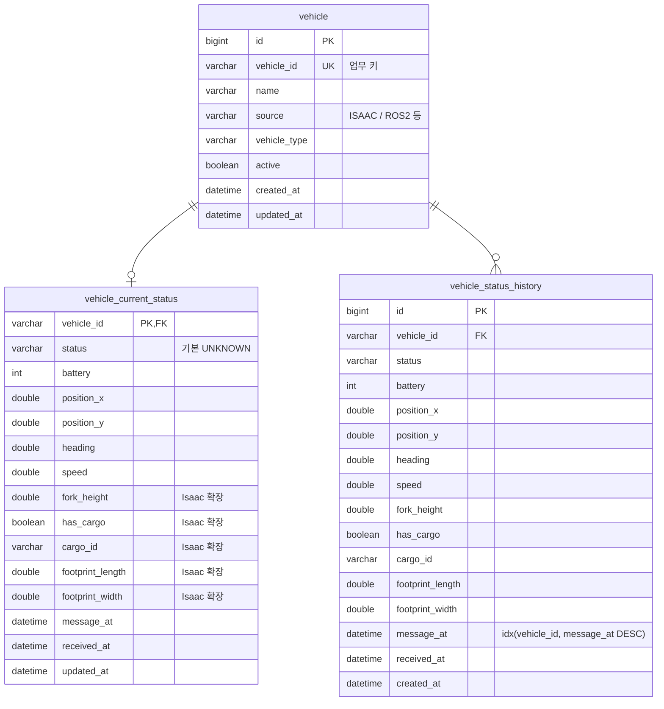
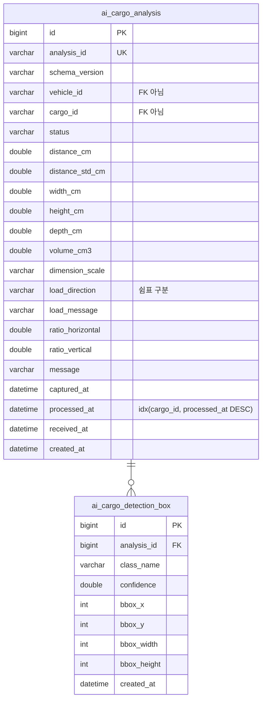
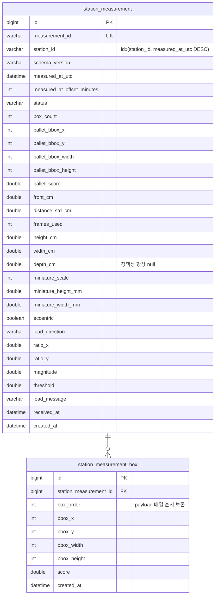
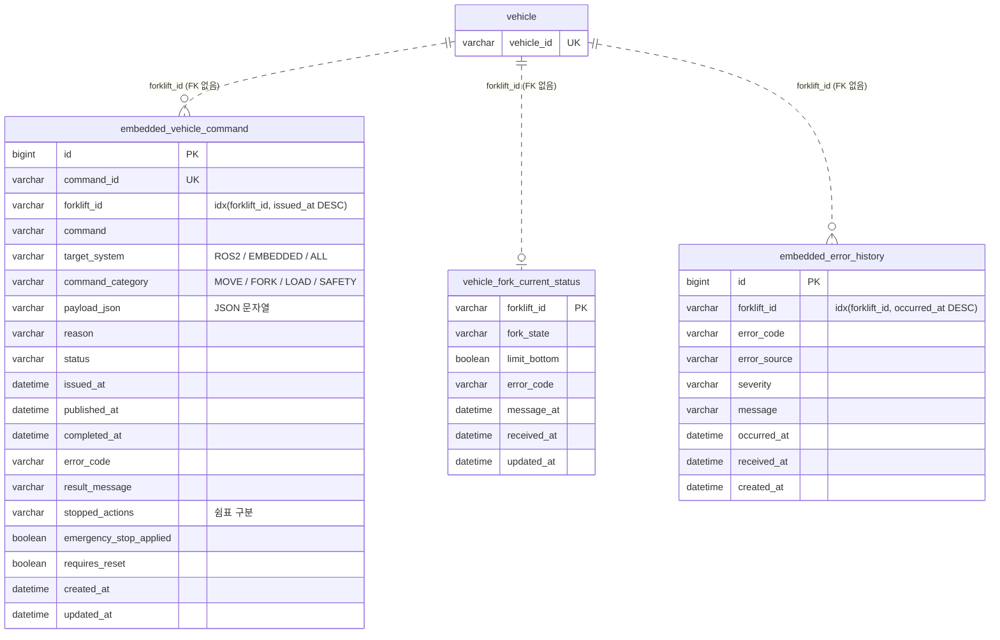
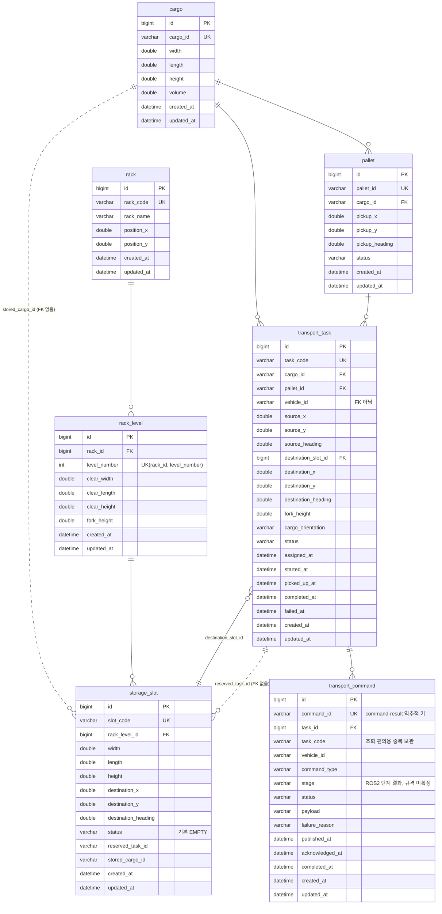

# F.A.S.T. ERD

## 기준

- 근거 파일: `src/main/resources/db/schema.sql` (**origin/develop 기준**, 2026-07-29 확인 — 20개 테이블)
  - ⚠️ 현재 브랜치(`feature/S15P11A304-dim-eval-onboard`)의 schema.sql에는 `cargo`·`pallet`·`rack`·`rack_level`·`storage_slot`·`transport_task`·`transport_command` 7개가 아직 없다. 이 문서는 develop을 따른다.
- 컬럼·제약은 DDL에 있는 것만 옮겼다. 코드에 없는 관계는 그리지 않았다.
- 선 표기
  - **실선** = DB에 FK 제약이 실제로 걸린 관계
  - **점선** = FK 없이 문자열 키로만 이어지는 논리적 관계 (`vehicle_id` / `cargo_id` / `forklift_id` 등)
    → AI·스테이션·임베디드 테이블은 MQTT로 들어온 결과를 그대로 적재하는 성격이라 FK를 걸지 않았다(`schema.sql` 주석 근거).

---

## 1. 전체 관계도 (키 컬럼만)

---

## 2. 도메인별 상세

### 2.1 차량 (vehicle 계열)

`vehicle`이 등록 원장이고, 현재 상태는 차량당 1행(`vehicle_current_status`), 변경 과정은 `vehicle_status_history`에 누적한다.
`fork_height`·`has_cargo`·`cargo_id`·`footprint_*`는 Isaac 확장 필드로 전부 nullable이며, ROS2 상태 메시지가 null로 덮어쓰지 않도록 `VehicleStatusService`가 "기존 값 보존"으로 병합한다.

### 2.2 AI 화물 분석 (`cargo/detected`)

`analysis_id`가 AI 채번 키라 UNIQUE로 중복 적재를 막는다. `load_direction`은 `["left","front"]` 같은 배열을 쉼표 문자열로 저장한다(JSON 컬럼 미사용 원칙 — H2 호환).

### 2.3 측정 스테이션 (`fast/station/+/measurement`)

AI 분석과 규격(키 표기·시각 타입·pallet 의미)이 달라 별도 도메인으로 분리했다.
시각은 UTC(`measured_at_utc`) + 오프셋 분(`measured_at_offset_minutes`, +09:00 → 540)으로 쪼개 저장해 `OffsetDateTime`을 손실 없이 복원한다. 파렛트는 박스와 의미가 달라 부모 테이블 컬럼으로 보존한다.

### 2.4 차량 명령·임베디드 상태

테이블명 `embedded_vehicle_command`와 컬럼 `forklift_id`는 이름이 도메인과 어긋나지만 운영 DB 이관 위험 때문에 유지한다(애플리케이션은 `vehicleId`, Mapper가 매핑). ROS2 이동 명령까지 이 테이블에 저장한다.

### 2.5 창고·적재 위치·운반 작업

좌표·크기는 m, heading은 degree로 차량 위치 규격과 동일하다.
`rack` → `rack_level`(단) → `storage_slot`(슬롯) 3단 구조이고, 화물 크기와 슬롯 여유치수(`clear_*`)를 비교해 적재 위치를 추천한다.
`transport_task`가 업무 단위, `transport_command`가 실제 MQTT 발행 단위다 — 재시도하면 한 Task에 여러 command가 붙는다.

---

## 3. DB에 저장하지 않는 것

- 차량 **위치**(`forklift/+/location`)와 **경로**(`forklift/+/path`)는 이력 테이블 없이 WebSocket으로만 중계한다. 필요해지면 `vehicle_location_history`로 별도 분리하기로 했다.
- 인덱스는 전부 `CREATE TABLE` 인라인이다. MySQL이 `CREATE INDEX IF NOT EXISTS`를 지원하지 않는데, 테스트에서 schema.sql이 컨텍스트마다 재실행돼 "이미 존재" 오류가 나기 때문이다.
