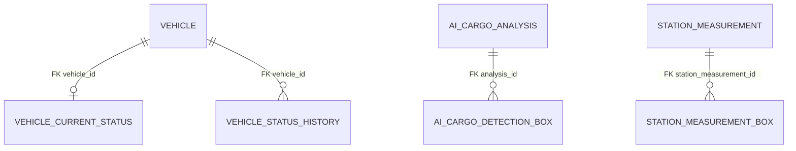

# F.A.S.T. Database Schema Draft

## 1. 문서 목적

현재 저장소의 `schema.sql`, MyBatis Mapper XML, Java Domain/DTO, Service, Controller, MQTT Router, WebSocket Broadcaster와 기존 테스트를 기준으로 실제 구현된 DB 구조와 데이터 흐름을 기록한다. 이 문서는 초안이며 코드에 없는 테이블·컬럼은 포함하지 않는다.

## 2. 분석 기준

- 기준일: 2026-07-23
- 빌드: Java 21, Spring Boot 3.3.4, MyBatis Spring Boot Starter 3.0.3
- 운영/로컬 DB: MySQL Connector/J, `application-local.yml`
- 테스트 DB: H2 in-memory, MySQL 호환 모드, `application-test.yml`
- DDL: `src/main/resources/db/schema.sql`
- SQL: `src/main/resources/mapper/*.xml` 10개
- 코드: `src/main/java`, 테스트 근거: `src/test/java`, `src/test/resources`
- 운영 코드와 SQL은 변경하지 않고 문서만 작성했다.

주요 구현 도메인은 차량 등록·현재 상태·상태 이력, AI 화물 분석, 측정 스테이션 결과, 임베디드 명령·포크 상태·오류 이력이다. Isaac/ROS2 위치·경로 메시지는 DB에 저장하지 않고 WebSocket으로 전달한다.

## 3. 프로젝트 데이터 흐름

### REST → Service → Mapper → DB

- 차량 등록/조회: `VehicleController` → `VehicleService` → `VehicleMapper`, `VehicleCurrentStatusMapper` → `vehicle`, `vehicle_current_status`
- 상태 이력 조회: `VehicleController` → `VehicleStatusHistoryService` → `VehicleStatusHistoryMapper` → `vehicle_status_history`
- AI 조회: `AiCargoAnalysisController` → `AiCargoAnalysisService` → AI Mapper 2개 → AI 테이블 2개
- 스테이션 조회: `StationMeasurementController` → `StationMeasurementService` → 스테이션 Mapper 2개 → 스테이션 테이블 2개
- 임베디드 명령: `EmbeddedCommandController` → `EmbeddedCommandService` → `EmbeddedVehicleCommandMapper` → `embedded_vehicle_command` → MQTT publish

### MQTT → Router → Service → DB/WebSocket

`MqttMessageReceiver`가 `mqttInputChannel` 메시지를 받고 `MqttMessageRouter.route(topic, payload)`로 전달한다. Router는 토픽과 payload 식별자 일치를 확인한 뒤 다음 Service로 위임한다.

- `forklift/+/status` → `ForkliftStatusService` 또는 `IsaacForkliftStatusService` → `VehicleStatusService` → 현재 상태 upsert + 이력 insert → 차량 상태 WebSocket
- `forklift/+/location` → `ForkliftLocationService` 또는 `IsaacForkliftLocationService` → 등록 여부 조회 → 위치 WebSocket(위치 DB 저장 없음)
- `forklift/+/path` → `IsaacForkliftPathService` → 등록 여부 조회 → 경로 WebSocket(DB 저장 없음)
- `cargo/detected` → `AiCargoAnalysisService` → 분석/박스 insert → AI WebSocket
- `fast/station/+/measurement` → `StationMeasurementService` → 측정/박스 insert → 스테이션 WebSocket
- `forklift/+/command-result` → `EmbeddedCommandResultService` → 명령 update → 결과 WebSocket
- `forklift/+/fork-status` → `EmbeddedForkStatusService` → 포크 현재 상태 upsert → 포크 WebSocket
- `forklift/+/error` → `EmbeddedErrorService` → 오류 이력 insert → 오류 WebSocket

### WebSocket 전달

`WebSocketConfig`의 STOMP endpoint를 통해 Broadcaster가 `SimpMessagingTemplate.convertAndSend`를 호출한다. 차량 이벤트는 전체/차량별 토픽, AI는 전체/화물별 토픽, 스테이션은 전체/스테이션별 토픽에 각각 전송한다. Broadcaster가 전송 예외를 내부에서 로깅하고 흡수하므로 DB 작업을 WebSocket 실패로 롤백하지 않는다.

## 4. 전체 테이블 요약

| 테이블 | 역할 | PK | FK | 주요 UNIQUE/INDEX |
|---|---|---|---|---|
| `vehicle` | 차량 기준정보 | `id` | 없음 | UQ `vehicle_id` |
| `vehicle_current_status` | 차량별 최신 상태 | `vehicle_id` | `vehicle.vehicle_id` | PK 자체 |
| `vehicle_status_history` | 차량 상태 누적 이력 | `id` | `vehicle.vehicle_id` | `(vehicle_id, message_at DESC)` |
| `ai_cargo_analysis` | AI 분석 부모 | `id` | 없음 | UQ `analysis_id`, `(cargo_id, processed_at DESC)` |
| `ai_cargo_detection_box` | AI 감지 박스 | `id` | `ai_cargo_analysis.id` | FK 인덱스는 DB 구현 의존 |
| `station_measurement` | 스테이션 측정 부모 | `id` | 없음 | UQ `measurement_id`, `(station_id, measured_at_utc DESC)` |
| `station_measurement_box` | 스테이션 감지 박스 | `id` | `station_measurement.id` | FK 인덱스는 DB 구현 의존 |
| `embedded_vehicle_command` | 임베디드 명령/결과 | `id` | 없음 | UQ `command_id`, `(forklift_id, issued_at DESC)` |
| `vehicle_fork_current_status` | 차량별 포크 최신 상태 | `forklift_id` | 없음 | PK 자체 |
| `embedded_error_history` | 임베디드 오류 이력 | `id` | 없음 | `(forklift_id, occurred_at DESC)` |

분석 테이블 수는 10개, Mapper XML 수는 10개다.

## 5. ER Diagram

실제 DDL의 FK만 표시한다.

FK가 없는 논리 연결:

- `ai_cargo_analysis.vehicle_id`는 `vehicle.vehicle_id`와 문자열로만 연결되며 DB FK가 없다.
- `ai_cargo_analysis.cargo_id`는 외부 식별자이며 이 저장소에 cargo 테이블이 없다.
- `station_measurement.station_id`는 외부 스테이션 식별자이며 별도 station 테이블 FK가 없다.
- `embedded_vehicle_command.forklift_id`, `vehicle_fork_current_status.forklift_id`, `embedded_error_history.forklift_id`는 애플리케이션에서 차량 등록 여부를 검사하지만 DB FK는 없다.

## 6. 테이블 상세

### vehicle

#### 목적

차량 등록 정보와 활성 여부를 보관한다.

#### 컬럼

| 컬럼 | SQL 타입 | NULL | 기본값 | PK | FK | UNIQUE | INDEX | 대응 Java 필드 | 설명 |
|---|---|---:|---|---:|---|---:|---:|---|---|
| id | BIGINT AUTO_INCREMENT | N | 자동 증가 | Y | - | Y | Y | `id` | 내부 식별자 |
| vehicle_id | VARCHAR(50) | N | - | N | - | Y | Y | `vehicleId` | 외부 차량 식별자 |
| name | VARCHAR(100) | N | - | N | - | N | N | `name` | 차량명 |
| source | VARCHAR(20) | N | - | N | - | N | N | `source` | `VehicleSource` |
| vehicle_type | VARCHAR(30) | Y | NULL | N | - | N | N | `vehicleType` | 차량 유형 |
| active | BOOLEAN | N | TRUE | N | - | N | N | `active` | 활성 여부 |
| created_at | DATETIME | N | - | N | - | N | N | `createdAt` | 생성 시각 |
| updated_at | DATETIME | N | - | N | - | N | N | `updatedAt` | 수정 시각 |

#### 제약조건

PK `id`, `uk_vehicle_vehicle_id(vehicle_id)`.

#### 인덱스

PK와 UNIQUE 인덱스 외 명시 인덱스 없음.

#### 사용 Mapper

`VehicleMapper`: insert, 단건/존재 조회, 활성 차량/식별자 목록 조회.

#### 사용 Service

`VehicleService`와 차량 존재 검사가 필요한 상태·위치·임베디드 Service.

#### 연결 API 또는 MQTT 흐름

`POST /api/vehicles`, `GET /api/vehicles`, `GET /api/vehicles/{vehicleId}`. 여러 MQTT 흐름에서 등록 여부 기준으로 사용.

#### 테스트

`VehicleMapperTest`, `VehicleServiceTest`, `VehicleControllerIntegrationTest`.

### vehicle_current_status

#### 목적

차량당 최신 상태 한 행을 유지한다.

#### 컬럼

| 컬럼 | SQL 타입 | NULL | 기본값 | PK | FK | UNIQUE | INDEX | 대응 Java 필드 | 설명 |
|---|---|---:|---|---:|---|---:|---:|---|---|
| vehicle_id | VARCHAR(50) | N | - | Y | `vehicle.vehicle_id` | Y | Y | `vehicleId` | 차량 식별자 |
| status | VARCHAR(20) | N | `'UNKNOWN'` | N | - | N | N | `status` | `VehicleStatus` |
| battery | INT | Y | NULL | N | - | N | N | `battery` | 0~100 애플리케이션 검증 |
| position_x | DOUBLE | Y | NULL | N | - | N | N | `positionX` | X 좌표 |
| position_y | DOUBLE | Y | NULL | N | - | N | N | `positionY` | Y 좌표 |
| heading | DOUBLE | Y | NULL | N | - | N | N | `heading` | 방향 |
| speed | DOUBLE | Y | NULL | N | - | N | N | `speed` | 속도 |
| message_at | DATETIME | Y | NULL | N | - | N | N | `messageAt` | 메시지 기준 시각 |
| received_at | DATETIME | N | - | N | - | N | N | `receivedAt` | 서버 수신 시각 |
| updated_at | DATETIME | N | - | N | - | N | N | `updatedAt` | 갱신 시각 |

#### 제약조건

PK `vehicle_id`, FK `fk_vehicle_current_status_vehicle`.

#### 인덱스

PK 인덱스. 상태 집계용 `status` 단독 인덱스는 없다.

#### 사용 Mapper

`VehicleCurrentStatusMapper`: 단건/다건 조회, `ON DUPLICATE KEY UPDATE` upsert, 활성 차량 상태 집계.

#### 사용 Service

`VehicleStatusService`, `VehicleService`.

#### 연결 API 또는 MQTT 흐름

차량 상태 MQTT/테스트 상태 REST → upsert; 차량 목록·상세·상태 집계 API → 조회; 상태 WebSocket.

#### 테스트

`VehicleCurrentStatusMapperTest`, `VehicleStatusServiceTest`, `VehicleStatusServiceIntegrationTest`, `VehicleStatusServiceRollbackIntegrationTest`.

### vehicle_status_history

#### 목적

수락된 차량 상태 메시지를 누적 보관한다.

#### 컬럼

| 컬럼 | SQL 타입 | NULL | 기본값 | PK | FK | UNIQUE | INDEX | 대응 Java 필드 | 설명 |
|---|---|---:|---|---:|---|---:|---:|---|---|
| id | BIGINT AUTO_INCREMENT | N | 자동 증가 | Y | - | Y | Y | `id` | 이력 식별자 |
| vehicle_id | VARCHAR(50) | N | - | N | `vehicle.vehicle_id` | N | Y | `vehicleId` | 차량 식별자 |
| status | VARCHAR(20) | N | - | N | - | N | N | `status` | 상태 |
| battery | INT | Y | NULL | N | - | N | N | `battery` | 배터리 |
| position_x | DOUBLE | Y | NULL | N | - | N | N | `positionX` | X 좌표 |
| position_y | DOUBLE | Y | NULL | N | - | N | N | `positionY` | Y 좌표 |
| heading | DOUBLE | Y | NULL | N | - | N | N | `heading` | 방향 |
| speed | DOUBLE | Y | NULL | N | - | N | N | `speed` | 속도 |
| message_at | DATETIME | Y | NULL | N | - | N | Y | `messageAt` | 메시지 시각 |
| received_at | DATETIME | N | - | N | - | N | N | `receivedAt` | 수신 시각 |
| created_at | DATETIME | N | - | N | - | N | N | `createdAt` | 생성 시각 |

#### 제약조건

PK `id`, FK `fk_vehicle_status_history_vehicle`.

#### 인덱스

`idx_vehicle_status_history_vehicle_message(vehicle_id, message_at DESC)`.

#### 사용 Mapper

`VehicleStatusHistoryMapper`: insert, 차량별 최신순 제한 조회.

#### 사용 Service

`VehicleStatusService`, `VehicleStatusHistoryService`.

#### 연결 API 또는 MQTT 흐름

차량 상태 MQTT → insert; `GET /api/vehicles/{vehicleId}/status-history?limit=` → 조회.

#### 테스트

`VehicleStatusHistoryMapperTest`, `VehicleStatusHistoryServiceTest`, `VehicleStatusServiceRollbackIntegrationTest`.

### ai_cargo_analysis

#### 목적

AI 화물 분석 결과의 부모 레코드를 보관한다.

#### 컬럼

| 컬럼 | SQL 타입 | NULL | 기본값 | PK | FK | UNIQUE | INDEX | 대응 Java 필드 | 설명 |
|---|---|---:|---|---:|---|---:|---:|---|---|
| id | BIGINT AUTO_INCREMENT | N | 자동 증가 | Y | - | Y | Y | `id` | 내부 식별자 |
| analysis_id | VARCHAR(100) | N | - | N | - | Y | Y | `analysisId` | 외부 분석 식별자 |
| schema_version | VARCHAR(20) | N | - | N | - | N | N | `schemaVersion` | 메시지 버전 |
| vehicle_id | VARCHAR(50) | Y | NULL | N | - | N | N | `vehicleId` | 논리 차량 ID |
| cargo_id | VARCHAR(50) | Y | NULL | N | - | N | Y | `cargoId` | 외부 화물 ID |
| status | VARCHAR(30) | N | - | N | - | N | N | `status` | `AiAnalysisStatus` |
| distance_cm | DOUBLE | Y | NULL | N | - | N | N | `distanceCm` | 거리 |
| distance_std_cm | DOUBLE | Y | NULL | N | - | N | N | `distanceStdCm` | 거리 표준편차 |
| width_cm | DOUBLE | Y | NULL | N | - | N | N | `widthCm` | 폭 |
| height_cm | DOUBLE | Y | NULL | N | - | N | N | `heightCm` | 높이 |
| depth_cm | DOUBLE | Y | NULL | N | - | N | N | `depthCm` | 깊이 |
| volume_cm3 | DOUBLE | Y | NULL | N | - | N | N | `volumeCm3` | 부피 |
| dimension_scale | VARCHAR(20) | Y | NULL | N | - | N | N | `dimensionScale` | `DimensionScale` |
| load_direction | VARCHAR(50) | Y | NULL | N | - | N | N | `loadDirection` | 쉼표 결합 방향 |
| load_message | VARCHAR(500) | Y | NULL | N | - | N | N | `loadMessage` | 적재 메시지 |
| ratio_horizontal | DOUBLE | Y | NULL | N | - | N | N | `ratioHorizontal` | 수평 비율 |
| ratio_vertical | DOUBLE | Y | NULL | N | - | N | N | `ratioVertical` | 수직 비율 |
| message | VARCHAR(500) | Y | NULL | N | - | N | N | `message` | 분석 메시지 |
| captured_at | DATETIME | Y | NULL | N | - | N | N | `capturedAt` | 촬영 시각 |
| processed_at | DATETIME | N | - | N | - | N | Y | `processedAt` | 처리 시각 |
| received_at | DATETIME | N | - | N | - | N | N | `receivedAt` | 수신 시각 |
| created_at | DATETIME | N | - | N | - | N | N | `createdAt` | 생성 시각 |

#### 제약조건

PK `id`, `uk_ai_cargo_analysis_analysis_id(analysis_id)`. `vehicle_id`, `cargo_id` FK 없음.

#### 인덱스

`idx_ai_cargo_analysis_cargo_processed(cargo_id, processed_at DESC)`.

#### 사용 Mapper

`AiCargoAnalysisMapper`: insert, 중복 확인, analysis ID 조회, cargo별 최신 조회.

#### 사용 Service

`AiCargoAnalysisService`.

#### 연결 API 또는 MQTT 흐름

`cargo/detected` → 저장/WebSocket; `GET /api/ai/cargo-analysis/{analysisId}`, `GET /api/cargos/{cargoId}/ai-analysis/latest`.

#### 테스트

`AiCargoAnalysisMapperTest`, `AiCargoAnalysisServiceTest`, `AiCargoAnalysisIntegrationTest`.

### ai_cargo_detection_box

#### 목적

AI 분석 한 건의 0..N 감지 박스를 보관한다.

#### 컬럼

| 컬럼 | SQL 타입 | NULL | 기본값 | PK | FK | UNIQUE | INDEX | 대응 Java 필드 | 설명 |
|---|---|---:|---|---:|---|---:|---:|---|---|
| id | BIGINT AUTO_INCREMENT | N | 자동 증가 | Y | - | Y | Y | `id` | 박스 식별자 |
| analysis_id | BIGINT | N | - | N | `ai_cargo_analysis.id` | N | DB 의존 | `analysisId` | 부모 내부 ID |
| class_name | VARCHAR(50) | N | - | N | - | N | N | `className` | 클래스명 |
| confidence | DOUBLE | Y | NULL | N | - | N | N | `confidence` | 신뢰도 |
| bbox_x | INT | N | - | N | - | N | N | `bboxX` | X |
| bbox_y | INT | N | - | N | - | N | N | `bboxY` | Y |
| bbox_width | INT | N | - | N | - | N | N | `bboxWidth` | 너비 |
| bbox_height | INT | N | - | N | - | N | N | `bboxHeight` | 높이 |
| created_at | DATETIME | N | - | N | - | N | N | `createdAt` | 생성 시각 |

#### 제약조건

PK `id`, FK `fk_detection_box_analysis`.

#### 인덱스

명시 인덱스 없음. FK 인덱스 자동 생성 여부는 DB별 확인이 필요하다.

#### 사용 Mapper

`AiCargoDetectionBoxMapper`: insert, 부모 ID별 조회.

#### 사용 Service

`AiCargoAnalysisService`.

#### 연결 API 또는 MQTT 흐름

부모 분석과 동일한 MQTT/조회/WebSocket 흐름.

#### 테스트

`AiCargoDetectionBoxMapperTest`, `AiCargoAnalysisServiceTest`.

### station_measurement

#### 목적

측정 스테이션의 판정·거리·치수·적재 균형 결과를 보관한다.

#### 컬럼

| 컬럼 | SQL 타입 | NULL | 기본값 | PK | FK | UNIQUE | INDEX | 대응 Java 필드 | 설명 |
|---|---|---:|---|---:|---|---:|---:|---|---|
| id | BIGINT AUTO_INCREMENT | N | 자동 증가 | Y | - | Y | Y | `id` | 내부 ID |
| measurement_id | VARCHAR(100) | N | - | N | - | Y | Y | `measurementId` | 외부 측정 ID |
| station_id | VARCHAR(50) | N | - | N | - | N | Y | `stationId` | 외부 스테이션 ID |
| schema_version | VARCHAR(20) | N | - | N | - | N | N | `schemaVersion` | 메시지 버전 |
| measured_at_utc | DATETIME | N | - | N | - | N | Y | `measuredAtUtc` | UTC 변환 시각 |
| measured_at_offset_minutes | INT | N | - | N | - | N | N | `measuredAtOffsetMinutes` | 원본 UTC 오프셋 분 |
| status | VARCHAR(20) | N | - | N | - | N | N | `status` | `StationMeasurementStatus` |
| box_count | INT | Y | NULL | N | - | N | N | `boxCount` | 박스 수 |
| pallet_bbox_x | INT | Y | NULL | N | - | N | N | `palletBboxX` | 파렛트 bbox X |
| pallet_bbox_y | INT | Y | NULL | N | - | N | N | `palletBboxY` | 파렛트 bbox Y |
| pallet_bbox_width | INT | Y | NULL | N | - | N | N | `palletBboxWidth` | 파렛트 bbox 너비 |
| pallet_bbox_height | INT | Y | NULL | N | - | N | N | `palletBboxHeight` | 파렛트 bbox 높이 |
| pallet_score | DOUBLE | Y | NULL | N | - | N | N | `palletScore` | 파렛트 점수 |
| front_cm | DOUBLE | Y | NULL | N | - | N | N | `frontCm` | 정면 거리 |
| distance_std_cm | DOUBLE | Y | NULL | N | - | N | N | `distanceStdCm` | 거리 표준편차 |
| frames_used | INT | Y | NULL | N | - | N | N | `framesUsed` | 사용 프레임 |
| height_cm | DOUBLE | Y | NULL | N | - | N | N | `heightCm` | 높이 |
| width_cm | DOUBLE | Y | NULL | N | - | N | N | `widthCm` | 너비 |
| depth_cm | DOUBLE | Y | NULL | N | - | N | N | `depthCm` | 정책상 항상 null |
| miniature_scale | INT | Y | NULL | N | - | N | N | `miniatureScale` | 축척 |
| miniature_height_mm | DOUBLE | Y | NULL | N | - | N | N | `miniatureHeightMm` | 미니어처 높이 |
| miniature_width_mm | DOUBLE | Y | NULL | N | - | N | N | `miniatureWidthMm` | 미니어처 너비 |
| eccentric | BOOLEAN | Y | NULL | N | - | N | N | `eccentric` | 편심 여부 |
| load_direction | VARCHAR(50) | Y | NULL | N | - | N | N | `loadDirection` | 쉼표 결합 방향 |
| ratio_x | DOUBLE | Y | NULL | N | - | N | N | `ratioX` | X 적재 비율 |
| ratio_y | DOUBLE | Y | NULL | N | - | N | N | `ratioY` | Y 적재 비율 |
| magnitude | DOUBLE | Y | NULL | N | - | N | N | `magnitude` | 편심 크기 |
| threshold | DOUBLE | Y | NULL | N | - | N | N | `threshold` | 판정 임계값 |
| load_message | VARCHAR(500) | Y | NULL | N | - | N | N | `loadMessage` | 판정 메시지 |
| received_at | DATETIME | N | - | N | - | N | N | `receivedAt` | 수신 시각 |
| created_at | DATETIME | N | - | N | - | N | N | `createdAt` | 생성 시각 |

#### 제약조건

PK `id`, `uk_station_measurement_measurement_id(measurement_id)`. `station_id` FK 없음.

#### 인덱스

`idx_station_measurement_station_measured(station_id, measured_at_utc DESC)`.

#### 사용 Mapper

`StationMeasurementMapper`: insert, 중복 확인, ID 조회, 스테이션별 최신 조회.

#### 사용 Service

`StationMeasurementService`, 변환은 `StationMeasurementAdapter`.

#### 연결 API 또는 MQTT 흐름

`fast/station/{station_id}/measurement` → 저장/WebSocket; `GET /api/stations/{stationId}/measurements/latest`, `GET /api/stations/measurements/{measurementId}`.

#### 테스트

`StationMeasurementMapperTest`, `StationMeasurementIntegrationTest`, `StationMeasurementRollbackIntegrationTest`, `StationMeasurementControllerIntegrationTest`.

### station_measurement_box

#### 목적

스테이션 측정의 detection box 배열과 원래 순서를 보관한다.

#### 컬럼

| 컬럼 | SQL 타입 | NULL | 기본값 | PK | FK | UNIQUE | INDEX | 대응 Java 필드 | 설명 |
|---|---|---:|---|---:|---|---:|---:|---|---|
| id | BIGINT AUTO_INCREMENT | N | 자동 증가 | Y | - | Y | Y | `id` | 박스 ID |
| station_measurement_id | BIGINT | N | - | N | `station_measurement.id` | N | DB 의존 | `stationMeasurementId` | 부모 ID |
| box_order | INT | N | - | N | - | N | N | `boxOrder` | 배열 순서 |
| bbox_x | INT | Y | NULL | N | - | N | N | `bboxX` | 선택 bbox X |
| bbox_y | INT | Y | NULL | N | - | N | N | `bboxY` | 선택 bbox Y |
| bbox_width | INT | Y | NULL | N | - | N | N | `bboxWidth` | 선택 bbox 너비 |
| bbox_height | INT | Y | NULL | N | - | N | N | `bboxHeight` | 선택 bbox 높이 |
| score | DOUBLE | Y | NULL | N | - | N | N | `score` | 점수 |
| created_at | DATETIME | N | - | N | - | N | N | `createdAt` | 생성 시각 |

#### 제약조건

PK `id`, FK `fk_station_measurement_box_measurement`. `(station_measurement_id, box_order)` UNIQUE는 없다.

#### 인덱스

명시 인덱스 없음. FK 인덱스 자동 생성 여부는 DB별 확인이 필요하다.

#### 사용 Mapper

`StationMeasurementBoxMapper`: insert, 부모 ID별 `box_order, id` 순 조회.

#### 사용 Service

`StationMeasurementService`.

#### 연결 API 또는 MQTT 흐름

부모 측정과 동일한 MQTT/조회/WebSocket 흐름.

#### 테스트

`StationMeasurementBoxMapperTest`, `StationMeasurementRollbackIntegrationTest`.

### embedded_vehicle_command

#### 목적

REST 명령 발행 상태와 MQTT 실행 결과를 한 행에 보관한다.

#### 컬럼

| 컬럼 | SQL 타입 | NULL | 기본값 | PK | FK | UNIQUE | INDEX | 대응 Java 필드 | 설명 |
|---|---|---:|---|---:|---|---:|---:|---|---|
| id | BIGINT AUTO_INCREMENT | N | 자동 증가 | Y | - | Y | Y | `id` | 내부 ID |
| command_id | VARCHAR(100) | N | - | N | - | Y | Y | `commandId` | UUID 명령 ID |
| forklift_id | VARCHAR(50) | N | - | N | - | N | Y | `forkliftId` | 논리 차량 ID |
| command | VARCHAR(30) | N | - | N | - | N | N | `command` | `EmbeddedCommandType` |
| reason | VARCHAR(100) | Y | NULL | N | - | N | N | `reason` | 명령 사유 |
| status | VARCHAR(20) | N | - | N | - | N | N | `status` | `EmbeddedCommandStatus` |
| issued_at | DATETIME | N | - | N | - | N | Y | `issuedAt` | 발행 요청 시각 |
| published_at | DATETIME | Y | NULL | N | - | N | N | `publishedAt` | MQTT 발행 성공 시각 |
| completed_at | DATETIME | Y | NULL | N | - | N | N | `completedAt` | 실행 완료 시각 |
| error_code | VARCHAR(50) | Y | NULL | N | - | N | N | `errorCode` | 결과 오류 코드 |
| result_message | VARCHAR(500) | Y | NULL | N | - | N | N | `resultMessage` | 결과 메시지 |
| stopped_actions | VARCHAR(100) | Y | NULL | N | - | N | N | `stoppedActions` | 쉼표 결합 중단 동작 |
| emergency_stop_applied | BOOLEAN | Y | NULL | N | - | N | N | `emergencyStopApplied` | 비상정지 적용 |
| requires_reset | BOOLEAN | Y | NULL | N | - | N | N | `requiresReset` | 재설정 필요 |
| created_at | DATETIME | N | - | N | - | N | N | `createdAt` | 생성 시각 |
| updated_at | DATETIME | N | - | N | - | N | N | `updatedAt` | 수정 시각 |

#### 제약조건

PK `id`, `uk_embedded_vehicle_command_command_id(command_id)`. `forklift_id` FK 없음.

#### 인덱스

`idx_embedded_vehicle_command_forklift_issued(forklift_id, issued_at DESC)`.

#### 사용 Mapper

`EmbeddedVehicleCommandMapper`: insert/update, ID 존재/단건 조회, 차량별 최신순 조회.

#### 사용 Service

`EmbeddedCommandService`, `EmbeddedCommandResultService`.

#### 연결 API 또는 MQTT 흐름

`POST /api/vehicles/{forkliftId}/embedded-commands` → insert(PENDING) → MQTT publish → update(PUBLISHED/PUBLISH_FAILED); `forklift/{id}/command-result` → 종료 상태 update/WebSocket. 단건·목록 조회 API 제공.

#### 테스트

`EmbeddedVehicleCommandMapperTest`, `EmbeddedCommandServiceTest`, `EmbeddedCommandResultServiceTest`, `EmbeddedCommandIntegrationTest`.

### vehicle_fork_current_status

#### 목적

차량별 포크 최신 상태 한 행을 유지한다.

#### 컬럼

| 컬럼 | SQL 타입 | NULL | 기본값 | PK | FK | UNIQUE | INDEX | 대응 Java 필드 | 설명 |
|---|---|---:|---|---:|---|---:|---:|---|---|
| forklift_id | VARCHAR(50) | N | - | Y | - | Y | Y | `forkliftId` | 논리 차량 ID |
| fork_state | VARCHAR(20) | N | - | N | - | N | N | `forkState` | `EmbeddedForkState` |
| limit_bottom | BOOLEAN | N | - | N | - | N | N | `limitBottom` | 하단 리미트 |
| error_code | VARCHAR(50) | Y | NULL | N | - | N | N | `errorCode` | 오류 코드 |
| message_at | DATETIME | N | - | N | - | N | N | `messageAt` | 장치 시각 |
| received_at | DATETIME | N | - | N | - | N | N | `receivedAt` | 수신 시각 |
| updated_at | DATETIME | N | - | N | - | N | N | `updatedAt` | 갱신 시각 |

#### 제약조건

PK `forklift_id`; DB FK 없음.

#### 인덱스

PK 인덱스만 존재.

#### 사용 Mapper

`VehicleForkCurrentStatusMapper`: upsert, 단건 조회.

#### 사용 Service

`EmbeddedForkStatusService`.

#### 연결 API 또는 MQTT 흐름

`forklift/{id}/fork-status` → upsert/WebSocket; `GET /api/vehicles/{forkliftId}/fork-status`.

#### 테스트

`VehicleForkCurrentStatusMapperTest`, `EmbeddedForkStatusServiceTest`, `EmbeddedCommandIntegrationTest`.

### embedded_error_history

#### 목적

임베디드 오류를 시간순으로 누적 보관한다.

#### 컬럼

| 컬럼 | SQL 타입 | NULL | 기본값 | PK | FK | UNIQUE | INDEX | 대응 Java 필드 | 설명 |
|---|---|---:|---|---:|---|---:|---:|---|---|
| id | BIGINT AUTO_INCREMENT | N | 자동 증가 | Y | - | Y | Y | `id` | 이력 ID |
| forklift_id | VARCHAR(50) | N | - | N | - | N | Y | `forkliftId` | 논리 차량 ID |
| error_code | VARCHAR(50) | N | - | N | - | N | N | `errorCode` | 오류 코드 |
| error_source | VARCHAR(20) | N | - | N | - | N | N | `errorSource` | `EmbeddedErrorSource` |
| severity | VARCHAR(20) | N | - | N | - | N | N | `severity` | `EmbeddedErrorSeverity` |
| message | VARCHAR(500) | Y | NULL | N | - | N | N | `message` | 오류 메시지 |
| occurred_at | DATETIME | N | - | N | - | N | Y | `occurredAt` | 발생 시각 |
| received_at | DATETIME | N | - | N | - | N | N | `receivedAt` | 수신 시각 |
| created_at | DATETIME | N | - | N | - | N | N | `createdAt` | 생성 시각 |

#### 제약조건

PK `id`; DB FK/UNIQUE 없음.

#### 인덱스

`idx_embedded_error_history_forklift_occurred(forklift_id, occurred_at DESC)`.

#### 사용 Mapper

`EmbeddedErrorHistoryMapper`: insert, 차량별 최신순 제한 조회.

#### 사용 Service

`EmbeddedErrorService`.

#### 연결 API 또는 MQTT 흐름

`forklift/{id}/error` → insert/WebSocket; `GET /api/vehicles/{forkliftId}/embedded-errors?limit=`.

#### 테스트

`EmbeddedErrorHistoryMapperTest`, `EmbeddedErrorServiceTest`, `EmbeddedCommandIntegrationTest`.

## 7. Mapper 및 SQL 연결

| Mapper XML | 테이블 | 주요 SQL |
|---|---|---|
| `VehicleMapper.xml` | vehicle | insert, vehicle_id 단건/존재 조회, active 목록 |
| `VehicleCurrentStatusMapper.xml` | vehicle_current_status, vehicle | 단건/다건 조회, MySQL `ON DUPLICATE KEY UPDATE`, LEFT JOIN 상태 집계 |
| `VehicleStatusHistoryMapper.xml` | vehicle_status_history | insert, vehicle_id별 `message_at DESC, id DESC LIMIT` |
| `AiCargoAnalysisMapper.xml` | ai_cargo_analysis | insert, analysis_id 중복/단건, cargo별 최신 |
| `AiCargoDetectionBoxMapper.xml` | ai_cargo_detection_box | insert, analysis_id별 조회 |
| `StationMeasurementMapper.xml` | station_measurement | insert, measurement_id 중복/단건, station별 최신 |
| `StationMeasurementBoxMapper.xml` | station_measurement_box | insert, 부모별 순서 조회 |
| `EmbeddedVehicleCommandMapper.xml` | embedded_vehicle_command | insert, 전체 결과 필드 update, 단건/목록 |
| `VehicleForkCurrentStatusMapper.xml` | vehicle_fork_current_status | MySQL upsert, 단건 조회 |
| `EmbeddedErrorHistoryMapper.xml` | embedded_error_history | insert, 차량별 최신순 제한 조회 |

XML `resultMap`의 snake_case 컬럼과 Java camelCase 필드는 위 테이블 상세와 일치한다. Enum 필드는 MyBatis 기본 enum 이름 문자열 저장 방식에 의존한다.

## 8. 트랜잭션 정책

### 차량 상태 저장

`VehicleStatusService.updateCurrentStatus`가 `@Transactional`이다. 차량 존재 확인 → 기존 최신 상태 조회 → current upsert → history insert 순이며 history insert 실패 시 RuntimeException이 전파되어 upsert도 롤백된다. `VehicleStatusServiceRollbackIntegrationTest`가 이를 검증한다. 기존 `message_at`보다 늦지 않은(동일 포함) 입력은 stale로 판단하여 upsert, history, WebSocket을 모두 건너뛴다. 입력 timestamp가 null이면 서버 수신 시각을 사용한다.

### AI 분석 저장

`AiCargoAnalysisService.process`가 `@Transactional`이다. 검증과 `existsByAnalysisId` 후 부모 insert, 박스 insert를 같은 트랜잭션에서 수행한다. 박스 insert RuntimeException은 잡지 않아 부모까지 롤백된다. 중복은 선조회로 무시하고 DB UNIQUE가 최종 방어한다. 검증 `BusinessException`은 Service 내부에서 로그 후 흡수한다.

### 측정 스테이션 저장

`StationMeasurementService.process`가 `@Transactional`이다. `existsByMeasurementId` 후 부모 insert와 박스 insert를 같은 트랜잭션에서 수행하며 박스 실패는 부모까지 롤백된다. 중복은 기존 데이터를 덮어쓰지 않고 무시하며 UNIQUE가 최종 방어한다. `measuredAt`은 UTC `LocalDateTime`과 원본 오프셋 분으로 분리 저장하고 응답 때 복원한다.

### 임베디드 명령

`EmbeddedCommandService.issueCommand`는 한 트랜잭션에서 PENDING insert → MQTT publish 시도 → PUBLISHED 또는 PUBLISH_FAILED update를 수행한다. publish 실패는 의도적으로 잡아 PUBLISH_FAILED를 커밋한다. 결과 MQTT는 `EmbeddedCommandResultService.handleResult`가 command/forklift/type/상태 전이를 검사한 뒤 SUCCESS/FAILED 계열로 update한다. 종료 상태에 대한 중복 결과는 전이 거부로 무시한다.

주의: `EmbeddedCommandResultService`, `EmbeddedForkStatusService`, `EmbeddedErrorService`는 `@Transactional` 메서드 내부에서 넓은 `RuntimeException`을 잡고 반환한다. 단일 DML 위주라 부분 저장 위험은 제한적이지만, DB 예외를 트랜잭션 경계 밖으로 전달하지 않아 명시적 rollback 보장이 차량/AI/스테이션 흐름보다 약하다.

## 9. API·MQTT·DB 연결

| 입력 | Controller 또는 Router | Service | Mapper | 테이블 | 출력 |
|---|---|---|---|---|---|
| 차량 등록 | `VehicleController` | `VehicleService` | `VehicleMapper` | vehicle | REST 차량 응답 |
| 차량 상태 MQTT | `MqttMessageRouter` | `ForkliftStatusService`/`IsaacForkliftStatusService` → `VehicleStatusService` | Vehicle, CurrentStatus, History Mapper | vehicle, vehicle_current_status, vehicle_status_history | 상태 WebSocket |
| 차량 상태 이력 조회 | `VehicleController` | `VehicleStatusHistoryService` | `VehicleMapper`, `VehicleStatusHistoryMapper` | vehicle, vehicle_status_history | REST 이력 목록 |
| AI 분석 MQTT | `MqttMessageRouter` | `AiCargoAnalysisService` | AI Mapper 2개 | ai_cargo_analysis, ai_cargo_detection_box | AI WebSocket |
| 측정 스테이션 MQTT | `MqttMessageRouter` | `StationMeasurementService` | Station Mapper 2개 | station_measurement, station_measurement_box | 스테이션 WebSocket |
| 임베디드 명령 REST | `EmbeddedCommandController` | `EmbeddedCommandService` | `VehicleMapper`, `EmbeddedVehicleCommandMapper` | vehicle, embedded_vehicle_command | MQTT command/emergency + REST |
| 임베디드 결과 MQTT | `MqttMessageRouter` | `EmbeddedCommandResultService` | `EmbeddedVehicleCommandMapper` | embedded_vehicle_command | 결과 WebSocket |
| 포크 상태 MQTT | `MqttMessageRouter` | `EmbeddedForkStatusService` | `VehicleMapper`, `VehicleForkCurrentStatusMapper` | vehicle, vehicle_fork_current_status | 포크 WebSocket |
| 오류 MQTT | `MqttMessageRouter` | `EmbeddedErrorService` | `VehicleMapper`, `EmbeddedErrorHistoryMapper` | vehicle, embedded_error_history | 오류 WebSocket |

## 10. 인덱스 설계

현재 명시된 복합 인덱스는 실제 조회 정렬과 맞는다: 차량 이력 `(vehicle_id, message_at DESC)`, AI 최신 `(cargo_id, processed_at DESC)`, 스테이션 최신 `(station_id, measured_at_utc DESC)`, 명령 목록 `(forklift_id, issued_at DESC)`, 오류 목록 `(forklift_id, occurred_at DESC)`.

미확정 사항은 자식 테이블 FK 컬럼 인덱스의 DB별 자동 생성 여부, `station_measurement_box(station_measurement_id, box_order)`의 중복 순서 방지 필요 여부, 상태 집계 규모 증가 시 `vehicle(active)`/상태 조회 인덱스 필요 여부다. 실제 쿼리 플랜과 데이터량 없이 추가 인덱스를 확정하지 않는다.

## 11. 운영 DB와 H2 차이

| 항목 | 운영/로컬 | 테스트 |
|---|---|---|
| DB | MySQL (`com.mysql.cj.jdbc.Driver`) | H2 (`org.h2.Driver`) |
| URL | `jdbc:mysql://.../fast_backend`, Asia/Seoul | `jdbc:h2:mem:fast_backend_test;MODE=MySQL;DB_CLOSE_DELAY=-1` |
| 스키마 적용 | `schema.sql` 자동 적용 안 함; 수동 적용 전제 | `spring.sql.init.mode=always`, 매 테스트 컨텍스트에 적용 |
| 초기 데이터 | `data-local.sql` 설정 | 테스트가 픽스처 직접 생성 |
| MQTT | 기본 활성 | 비활성 |
| SQL 호환 | MySQL 실제 문법 | MySQL 모드가 upsert/DDL 호환을 모사 |

H2 MySQL 모드는 실제 MySQL의 collation, charset, timezone, 인덱스 실행계획, 잠금/동시성, FK 인덱스 생성 방식까지 동일하게 보장하지 않는다. `DATETIME`에는 오프셋이 없으며 스테이션만 별도 오프셋 컬럼으로 손실을 방지한다.

## 12. 데이터 검증 정책

- MQTT topic 식별자와 payload 식별자가 다르면 Router에서 폐기한다.
- 차량 상태: 등록 차량만, battery 0~100, 상태 문자열 정규화, 동일/과거 timestamp 무시.
- AI: schema version, 상태별 필수/금지 데이터, bbox 크기, confidence, finite/양수 치수, 방향 중복·반대 조합 등을 Service에서 검사한다.
- 스테이션: schema version, 상태별 구조, bbox/score, 거리·치수, 축척, 적재 균형 식과 topic/payload station ID를 검사한다.
- 임베디드: 등록 차량, enum 값, 명령 결과의 command/forklift 일치, 허용 상태 전이를 검사한다.
- DB는 주로 PK/FK/UNIQUE/NOT NULL을 보장한다. 범위와 enum CHECK 제약은 없고 애플리케이션 검증에 의존한다.

## 13. 데이터 보존 정책

코드에 삭제, 보존 기간, 파티셔닝, 아카이빙, cascade delete 정책이 구현되어 있지 않다. current 테이블은 upsert로 최신 한 행만 유지하고, history/analysis/measurement/command/error 테이블은 계속 누적된다. FK에 `ON DELETE`가 없으므로 기본 RESTRICT/NO ACTION 동작에 의존한다. 운영 데이터 보존 기간과 정리 배치는 외부 확인이 필요하다.

## 14. 미확정 및 개선 필요 사항

1. 운영 MySQL에 현재 `schema.sql`이 실제 적용되었는지, 엔진/문자셋/collation이 무엇인지 저장소만으로 확인할 수 없다.
2. FK 없는 논리 식별자들의 참조 무결성은 애플리케이션 검사에만 의존한다. AI `vehicle_id`는 존재 검사도 하지 않는다.
3. AI/스테이션의 `exists` 후 insert는 동시 요청 경쟁 시 UNIQUE 위반이 날 수 있다. DB UNIQUE는 중복 저장을 막지만 두 번째 요청을 조용히 무시한다는 애플리케이션 의미까지 보장하지는 않는다.
4. 임베디드 MQTT 처리 Service의 내부 `RuntimeException` 흡수는 rollback/장애 관측 정책을 명확히 할 필요가 있다.
5. `station_measurement_box`의 부모별 `box_order` 중복 방지 제약은 없다.
6. enum/상태, 수치 범위, `box_count`와 자식 수 일치에 DB CHECK 제약이 없다.
7. `DATETIME` 사용 도메인의 서버/DB timezone 운영 규칙은 스테이션 measuredAt 외에는 명시적이지 않다.
8. 데이터 보존·삭제·개인/민감 데이터 분류·백업/복구 정책은 구현에서 확인되지 않는다.

## 15. 변경 관리 원칙

- 이 문서는 `schema.sql`, Mapper XML, Domain/DTO, Service를 함께 변경할 때 동기화한다.
- 신규 테이블/컬럼은 실제 DDL과 코드가 구현된 뒤 문서에 반영한다.
- FK가 없는 논리 관계는 ERD의 실제 FK 관계로 표시하지 않는다.
- 운영 DDL은 자동 실행되지 않으므로 배포 전 수동 적용 절차, 버전, 롤백 SQL과 적용 결과를 별도로 관리해야 한다.
- MySQL 변경은 H2 테스트 통과만으로 완료 판정하지 않고 운영과 동일한 MySQL 버전에서 DDL·쿼리·인덱스를 확인한다.
