# 화물 운송 관리 및 디지털 트윈 시스템 — 아키텍처

작성 기준일: 2026-08-12 · 근거·표기 규칙: [아키텍처-다이어그램-명세.md](아키텍처-다이어그램-명세.md)

```mermaid
flowchart LR
  subgraph GA["그룹 A — 클라우드 / 플랫폼 · AWS EC2 i15a304.p.ssafy.io"]
    direction TB
    F1["1) Frontend<br/>Next.js 16.2.6 · React 19<br/>TypeScript 5.7.3 · Tailwind CSS 4<br/>shadcn/ui · STOMP over SockJS<br/>@nvidia/ov-web-rtc 6.6<br/>포트 3000"]
    B2["2) Backend<br/>Java 21 · Spring Boot 3.3.4<br/>MyBatis 3.0.3 · REST API<br/>WebSocket STOMP<br/>Spring Integration MQTT<br/>Eclipse Paho 1.2.5<br/>포트 8080"]
    D3[("3) Database<br/>MySQL 8.0")]
    M4["4) Messaging<br/>Eclipse Mosquitto 2<br/>MQTT over TLS<br/>allow_anonymous false<br/>포트 8883"]
    SR["Streaming Relay<br/>MediaMTX<br/>RTSP 입력 8554<br/>WebRTC 재생 8889<br/>ICE 8189"]
  end

  subgraph GB["그룹 B — 측정 스테이션 · 전용 PC"]
    S5["5) Station Measurement<br/>Logitech BRIO 100 · USB 1920x1080<br/>TF-Nova 거리계 · 시리얼 · FoV 14도<br/>RTMDet-m + ONNX Runtime<br/>box·pallet 2클래스 · OpenCV<br/>화물 치수 · 전복 위험 · 편하중 측정"]
  end

  subgraph GC["그룹 C — 실제 무인 지게차"]
    direction TB
    subgraph E8["8) Edge — Jetson Orin Nano · JetPack 6 / L4T R36.4.7 · CUDA 12.6 · TensorRT 10.3 · USB 카메라 1280x720 · YDLIDAR X4-Pro"]
      direction LR
      V6["6) Onboard Vision<br/>RTMDet-s · TensorRT FP16<br/>OpenCV · pallet·hole 2클래스<br/>포크 정렬 오차 산출"]
      N7["7) Autonomous Driving<br/>ROS 2 Humble · Nav2 · AMCL<br/>SLAM · robot_localization<br/>맵 생성 · 위치 추정 · 경로 계획"]
    end
    EM9["9) Embedded<br/>ESP32-S3 · ESP-IDF / FreeRTOS<br/>I2C PCA9685 PWM · MPU6500 IMU<br/>MG996R 조향 서보<br/>구동 모터 · 포크 리프트"]
  end

  subgraph GD["그룹 D — 디지털 트윈 / 시뮬레이션"]
    T10["10) Digital Twin<br/>NVIDIA Isaac Sim 5.1<br/>Omniverse · USD<br/>가상 창고 다중 지게차 시뮬레이션<br/>실행 호스트 미정"]
  end

  F1 <--> |"REST API"| B2
  F1 <--> |"WebSocket / STOMP"| B2
  B2 --> |"SQL"| D3
  B2 <--> |"MQTT Paho"| M4
  M4 --> |"fast/station/measure_request"| S5
  S5 --> |"POST /api/stations/measurements"| B2
  M4 <--> |"forklift 차량ID command<br/>forklift 차량ID command-result"| E8
  E8 <--> |"UART 115200 8N1<br/>CRC-16 · 500ms 워치독"| EM9
  T10 --> |"RTSP 8554 · ffmpeg"| SR
  SR -.-> |"WebRTC 재생 8889"| F1
  T10 -.-> |"Omniverse WebRTC 직결<br/>49100 · 47998"| F1
  T10 -.-> |"상태 동기화"| M4
  N7 -.-> |"cmd_vel 인계 규칙 없음"| V6

  linkStyle 0,1,2,3,4,5,7,8 stroke:#1F7A3D,stroke-width:2px
  linkStyle 6,9,11,12 stroke:#C1670A,stroke-width:2px
  linkStyle 10 stroke:#8A8F98,stroke-width:1.5px

  style GA fill:#EEF2F9,stroke:#1B3B6F,stroke-width:2px
  style GB fill:#EAF3FB,stroke:#0B5FA5,stroke-width:2px
  style GC fill:#EDF6EE,stroke:#2E7D32,stroke-width:2px
  style E8 fill:#DFF0E1,stroke:#2E7D32,stroke-width:2px
  style GD fill:#E7F4F2,stroke:#12796B,stroke-width:2px
```

## 연결 검증 상태

| 선 | 뜻 |
|---|---|
| ■ 초록 실선 | **검증 완료** — 실물에서 왕복 확인된 연결 |
| ■ 주황 점선 | **부분 / 미검증** — 배선은 됐으나 실주행·실망 검증이 남음 |
| ■ 회색 점선 | **대체된 경로** — 설계상 존재하나 RTSP → MediaMTX 경로로 갈음한다 |

주황으로 표시한 것:

- **`forklift/{vehicleId}/command`** — 백엔드 → Nav2 MOVE 명령은 배선까지만 검증됐고 실주행 미검증. Jetson ↔ 브로커 연결은 지금 없어진 평문 브로커 기준으로 검증한 것이라 TLS 브로커로 재검증이 필요하다.
- **`WebRTC 재생 :8889`** — 시연 망이 UDP를 통째로 막아 ICE 협상이 끝나지 않는다. TCP 폴백(`:8189/tcp`)으로 우회한다.
- **`상태 동기화`** — 트윈 ↔ 브로커 구간 미검증.
- **`/cmd_vel` 인계 규칙 없음** — Nav2와 포크 정렬 루프가 같은 토픽을 동시에 잡을 수 있는데, 누가 언제 놓고 받는지 정해지지 않았다.

## 그리면 안 되는 연결

**Database ↔ Messaging 직결.** MySQL과 Mosquitto는 서로 모른다. MQTT로 들어온 메시지는 전부 백엔드(Spring Integration MQTT)를 거쳐 MyBatis로 DB에 반영된다. 이 화살표가 있으면 틀린 그림이다.

## 그룹 밖 — 공통

| 구분 | 구성 |
|---|---|
| **11) Infrastructure** | Docker Compose · AWS EC2 · GitLab CI/CD · systemd |
| **Development Tools** | Maven · npm · Colcon · CMake · pytest · H2 테스트 인메모리 DB · COCO 라벨 포맷 |
| **학습 전용 스택** | PyTorch · MMDetection · MMDeploy · Python 3.10 — **GPU 서버 전용이며 런타임이 아니다** |

## 이 시스템에 없는 것

그림에 들어가면 사실과 다르므로 넣지 않는다.

- **CVAT** — 라벨링은 레포 자체 도구(`ai/src/dataset/label_onboard.py`)로 했다. 경로·파일 이름에 `cvat`가 남아 있지만 이름뿐이다.
- **YOLO / Ultralytics** — 검토했으나 채택하지 않았다.
- **OV5647 CSI 카메라** — 커넥터·드라이버 문제로 USB 카메라로 교체했다.
- **강화학습 기반 포크 정렬** — 기하로 정확히 계산되는 관계라 채택하지 않았다.
- **GPU 서버의 런타임 서비스** — Mosquitto · Isaac Sim · Nav2 모두 2026-08-03에 내려갔다. GPU 서버는 학습 전용이다.
- **지게차 위의 PyTorch / MMDetection / ONNX Runtime** — 학습 스택과 스테이션 스택이다. 지게차에서 도는 것은 TensorRT뿐이다.
- **지게차 위의 Logitech BRIO / TF-Nova** — 측정 스테이션 장비다. 지게차 카메라는 1280×720 USB 카메라다.
